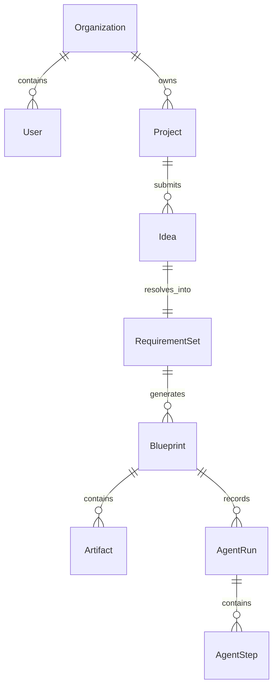

# 🏗️ Core Domain Model & ER Architecture

## Entity Relationship Overview

AutoEngineer AI models the architectural workflow from natural language business idea down to versioned production-ready artifacts.

---

## Domain Entity Definitions

### 1. `Organization`
The tenant root boundary. Owns projects, GitHub integrations, PM tool configurations, and user memberships.

### 2. `Project`
A specific software product or codebase under engineering analysis or architecture design. Linked to an optional target GitHub repository.

### 3. `Idea`
A natural-language prompt submitted by a user (e.g. *"Build a real-time collaborative whiteboarding platform with video conferencing"*). Contains initial scale, budget, and traffic parameters.

### 4. `RequirementSet`
Structured specifications produced by the **Product Manager Agent** after dynamic user intake clarification. Contains categorized epics, user stories, non-functional requirements, and sprint milestones.

### 5. `Blueprint` (Immutable Versioned Output)
A complete, immutable snapshot produced by a full execution of the 8-agent LangGraph workflow.
- *Key Concept*: Each agent execution creates a new versioned `Blueprint` (e.g. `v1.0.0`, `v1.1.0`). Historical blueprints are never modified, allowing side-by-side comparison of architectural revisions over time.

### 6. `Artifact` (Specific Generated File)
Individual design outputs attached to a specific `Blueprint` version:
- Architecture Diagrams (Mermaid/SVG)
- ER Diagrams & SQL Schemas
- OpenAPI 3.0 Specs (JSON/YAML)
- Folder Structure Trees & Coding Standards Docs
- Cost Estimates & Scaling Reports
- Compliance & Disaster Recovery Plans

### 7. `AgentRun` & `AgentStep`
The audit log tracking the multi-agent orchestration execution.
- `AgentRun`: Tracks graph-level metrics (total execution time, token usage, final status).
- `AgentStep`: Tracks individual agent back-and-forth decisions (e.g., *Security Agent rejected Solution Architect's JWT expiration strategy in favor of short-lived access tokens + refresh rotation*).
